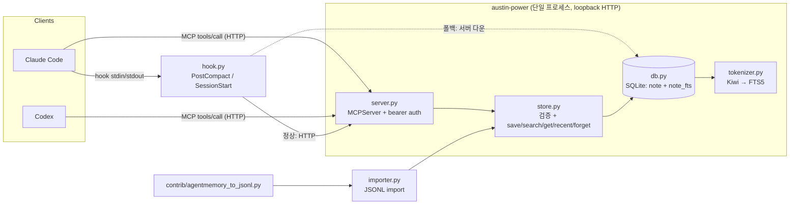

# austin-power — 설계 문서

## 1. 문제

코딩 에이전트(Claude Code, Codex 등)가 세션을 넘어 쓸 기억 저장소가 필요했다. 기존 범용 메모리 서버를 실사용하며 관측한 문제는 다음과 같았다:

- 작은 데이터(1MB)에 비해 상주 메모리가 컸다.
- 세션마다 여러 프로세스 계층이 떴다.
- 인덱스가 세대별 스냅샷으로 누적되어(수백 세대·수 GB) 계속 커졌다.
- 한국어 조사(을/를/이/가 등)가 그대로 토큰이 되어 검색이 자주 빗나갔다.

## 2. 설계 원칙

1. **단일 파일** — 서버·CLI·hook이 모두 같은 SQLite 파일(`memory.db`) 하나만 본다. 백업·이동·검사가 파일 하나로 끝난다.
2. **서버는 LLM을 호출하지 않는다** — 저장·검색은 순수 SQL이다. 요약이 필요한 지점(PostCompact)은 이미 클라이언트가 만든 요약을 받아 저장할 뿐이다.
3. **자동 캡처 없음** — 사용자/에이전트가 명시적으로 `save`를 부르거나, Claude Code의 PostCompact hook이 압축 시점에 요약을 넘겨줄 때만 기록된다. 서버가 임의로 대화를 관찰·수집하지 않는다.
4. **무상태 HTTP** — MCP 서버는 세션 상태를 들고 있지 않다. 각 요청은 `Authorization: Bearer <token>` 하나로 인증되고 독립적으로 처리된다. 재시작해도 잃을 상태가 없다.

## 3. 아키텍처



- `tokenizer.py`와 `db.py`(연결·마이그레이션·락)가 `store.py`(순수 SQL 함수)를 떠받친다.
- `server.py`(MCP 서버 + bearer 미들웨어 + uvicorn)와 `importer.py`/`hook.py`(가벼운 경로)가 모두 `store.py`만 호출한다.
- `cli.py`가 전부를 엮는다.

## 4. 토크나이저 규칙

- ASCII 식별자(`[A-Za-z0-9_]+(?:[./-][A-Za-z0-9_]+)*`)는 소문자화해 그대로 한 토큰으로 색인하고, **색인 시에만** `_`/`.`/`/`/`-` 기준으로 잘라 부분 토큰도 함께 저장한다(`note_fts` → `note_fts`, `note`, `fts`). 질의 시에는 부분 분리를 하지 않는다 — 사용자가 `note_fts`라고 검색하면 `note`만 있는 문서는 안 나온다.
- 비ASCII(한글 포함) 텍스트는 Kiwi로 형태소 분석하고, 체언/용언/어근/한자/외래어/숫자(`NN·VV·VA·XR·SH·SL·SN`) 태그만 남긴다 — 조사(JKO 등)·어미는 버린다.
- FTS5 가상 테이블은 `tokenize='kiwi'`로 이 토크나이저를 쓴다. 토크나이저 서명(`kiwi/<룰버전>/kiwipiepy-<ver>/model-<ver>`)이 바뀌면 다음에 DB를 여는 프로세스가 `note_fts`를 전체 재구축한다(행 수와 무관하게 한 번, 재색인이 아니라 마이그레이션이다).

## 5. 스키마

```sql
CREATE TABLE note (
  id INTEGER PRIMARY KEY,
  project TEXT NOT NULL DEFAULT '',
  kind TEXT NOT NULL,
  title TEXT NOT NULL,
  body TEXT NOT NULL,
  session_id TEXT,
  created_at INTEGER NOT NULL,
  updated_at INTEGER NOT NULL,
  UNIQUE (project, title)
) STRICT;
CREATE VIRTUAL TABLE note_fts USING fts5(title, body, content='note', content_rowid='id', tokenize='kiwi');
-- note_ai/note_ad/note_au 트리거가 note_fts를 note와 동기화한다.
CREATE TABLE meta (key TEXT PRIMARY KEY, value TEXT NOT NULL) STRICT;
```

`id`가 명시적 `INTEGER PRIMARY KEY`인 이유: 그렇지 않은 테이블은 `VACUUM`이 rowid를 재번호할 수 있어, external-content FTS(`content_rowid='id'`)가 어긋난다.

## 6. Hooks

- **PostCompact**: Claude Code가 압축하며 만든 `compact_summary`를 받아 `title="session "+session_id`, `kind="session"`으로 upsert한다(같은 세션 재압축은 같은 행을 덮어씀 — 최신 요약이 이전 내용을 포함하므로 손실 없음). 서버가 죽어 있으면(그리고 `server.lock`을 획득할 수 있으면) 같은 upsert를 DB에 직접 쓴다(폴백). 서버는 살아 있는데 응답이 없거나 느리면 폴백하지 않는다(이중 쓰기 방지).
- **SessionStart**: 프로젝트의 최근 기억(`recent`)을 `AUSTIN_POWER_INJECT_CHARS`(기본 4,000자) 한도까지 컨텍스트로 주입한다. 압축 직후 시작(`source=="compact"`)이거나 project를 알 수 없으면 아무것도 하지 않는다.
- hook 경로(`austin_power.hook` 최상위)는 `kiwipiepy`·`apsw`·`mcp`·`uvicorn`을 모듈 임포트 시점에 불러오지 않는다 — 매 훅 호출이 세션을 늦추지 않도록.

## 7. 원 설계 대비 변경점

| 원래 설계 | v0.1 | 이유 |
|---|---|---|
| 상주 데몬 없음, 세션마다 stdio 서버 | 전역 HTTP 서버 1개(상주) | Kiwi 모델 로딩 비용(초 단위)을 세션마다 지불하지 않고 한 번만 낸다. Kiwi 자체는 서버에 상주하지 않고 첫 호출 때 기동해 유휴 시 종료되는 별도 워커 프로세스에서 돈다(§2.5.1) — 유휴 서버는 ~70MB. |
| TypeScript + better-sqlite3 | Python + apsw | Kiwi(`kiwipiepy`)를 그대로 쓰고, apsw wheel이 SQLite를 번들해 환경의 SQLite 버전과 무관해지며, FTS5 커스텀 토크나이저를 Python으로 등록할 수 있다. |
| `tokenize='unicode61'` | Kiwi 기반 커스텀 토크나이저 `kiwi` | 한국어 조사·어미 분리가 필요하다. |
| `id TEXT PRIMARY KEY` | `id INTEGER PRIMARY KEY` | 명시적 정수 기본키가 없으면 `VACUUM`이 rowid를 재번호해 external-content FTS가 어긋난다. |
| 도구 4개 | 5개(`get` 추가) | `search`는 발췌만 돌려주므로 전문을 읽을 경로가 따로 필요하다. |
| `kind` 고정 목록 | 자유 슬러그 | 사용자마다 분류 체계가 다르다. |
| 증류는 에이전트가 자발적으로 | + PostCompact hook 자동 저장 | Claude Code가 압축 시 이미 만든 요약을 저장할 뿐이라 추가 LLM 호출이 없다. |
| 주입 상한을 토큰 수로 | 문자 수(`AUSTIN_POWER_INJECT_CHARS`, 기본 4,000) | 토큰 수는 모델·언어별로 달라 서버가 셀 수 없다. |
| "sqlite3로 그냥 열면 됨" | 읽기는 자유, 쓰기는 `kiwi` 토크나이저를 등록한 연결만 | `note`의 트리거가 `kiwi` 토크나이저를 요구하기 때문이다. |

## 8. 참고

- 기능명세: [`docs/specs/austin-power-v0.1-feature-spec.md`](specs/austin-power-v0.1-feature-spec.md)
- 사용자 가이드: [`README.md`](../README.md) (한국어) · [`README.en.md`](../README.en.md)
